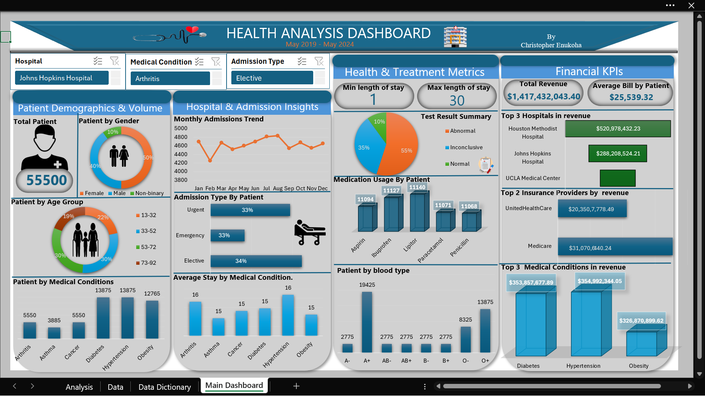

# Health-Analysis

## Introduction:
The analysis spans across 10 different hospitals and involves 4 health insurance providers in the united states of America. 

## Objective:
The objective of this analysis is to provide actionable insights into patient demographics, hospital admissions, treatment outcomes, and financial performance across 10 hospitals. It aims to support data-driven decisions that enhance healthcare delivery, optimize resource allocation, and improve patient care and revenue efficiency.

## Problem Statement:
Hospitals struggle to gain clear insights into patient demographics, treatment patterns, and financial performance. This makes it difficult to improve care quality, optimize resources, and manage costs. This analysis addresses that gap using data from 10 hospitals to uncover key trends and guide better decisions.

## Executive Summary:
1. ### Demographic Analysis
The dataset contains records of 55,500 patients, with 50% female, 40% male, and 10% non-binary.
Houston Methodist Hospital recorded the highest number of patients, with 20,402, representing 37% of the total patient count.
Age distribution shows that patients aged 33–52 and 53–72 each account for 30% of the total.
Medical conditions with the highest occurrences include diabetes, hypertension, and obesity, which together account for 73% of all cases.

2. ### Hospital & Admission Insights
The month of August recorded the highest number of admissions, totaling 4,832.
34% of the patients were admitted through elective procedures.
Arthritis and hypertension cases had the highest average length of stay at 16 days, 15 days for other medical conditions.

3. ### Health & Treatment Metrics
The minimum length of stay was 1 day, while the maximum was 30 days.
Across all hospitals, the most prescribed medications were Lipitor and Ibuprofen. However, at Houston Methodist Hospital, Aspirin and Ibuprofen were the most commonly administered.
Blood type distribution reveals that 35% of patients are A+. Among these, 9,990 patients suffer from hypertension.
Regarding test results across all hospitals:
55% were abnormal
10% were normal
35% were inconclusive

4. ### Financial Analysis
The total revenue generated by the 10 hospitals was $1,417,432,043.40.
The average bill per patient was $25,539.32.
Houston Methodist Hospital generated the highest revenue, contributing 37% of the total.
Medicare was the top insurance provider, contributing 50% of all revenue.
Hypertension cases accounted for the highest revenue by medical condition.

## Methodology / Detailed Analysis
The health data analysis was conducted using Microsoft Excel, covering 10 hospitals over a 5-year period. Data was sources from DataDNA. Data was cleaned and categorized into demographics, medical metrics, admissions, and financials. Key insights were derived using pivot tables, charts, and formulas. An interactive dashboard was created with slicers for filtering by hospital, condition, and admission type. The analysis helped uncover trends in patient volume, treatment patterns, and revenue performance.

## Recommendation 
**Target Preventive Care:** Focus on managing hypertension, diabetes, and obesity through awareness and preventive programs.

**Optimize Admission Procedures:** Balance elective and emergency admissions to reduce strain on resources.

**Improve Test Accuracy:** Reduce inconclusive test results through better diagnostics.

**Monitor Revenue Streams:** Strengthen partnerships with top insurance providers to maintain revenue flow.

## Conclusion 
The analysis reveals key patterns in patient demographics, admission trends, treatment outcomes, and revenue performance. Hypertension, diabetes, and obesity are the most common and financially impactful conditions. Houston Methodist Hospital leads in both patient volume and revenue generation. Elective procedures and abnormal test results are prevalent, highlighting areas for medical review.

